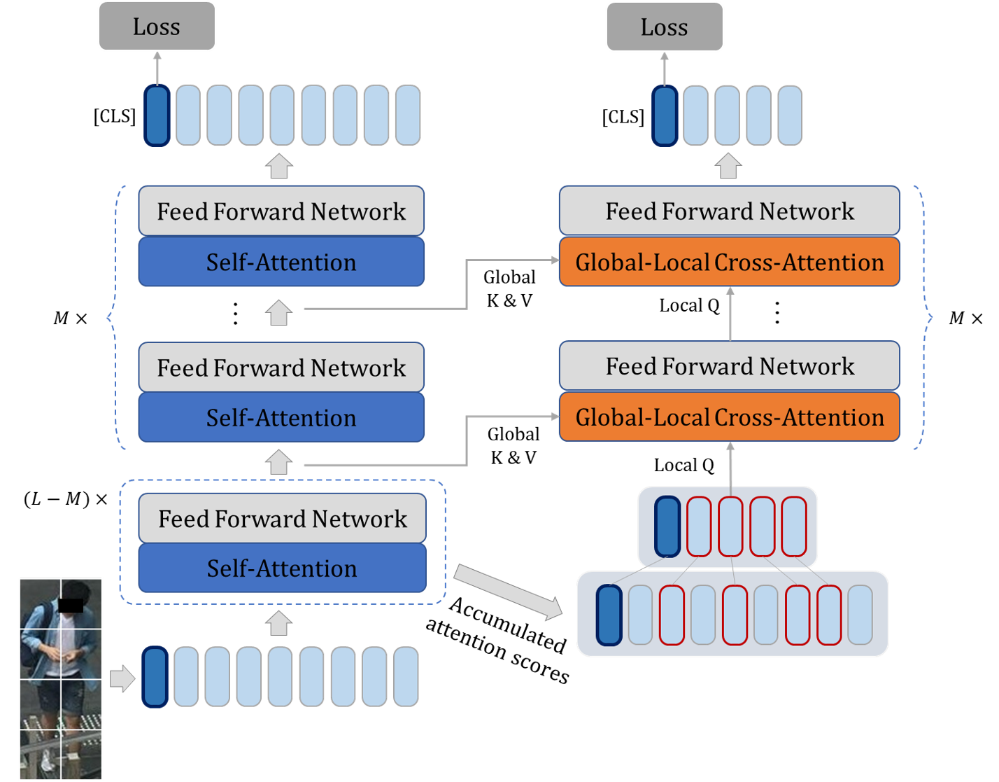
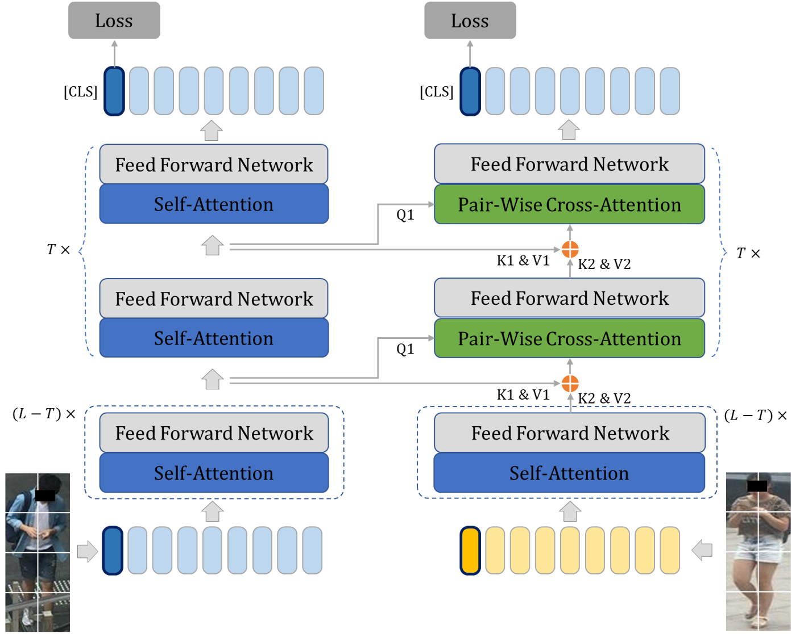

# Dual Cross-Attention Learning for Fine-Grained Visual Categorization and Object Re-Identification

This repository contains a **replication implementation** of the dual cross-attention learning approach proposed in the paper:

**Zhu, H., Ke, W., Li, D., Liu, J., Tian, L., & Shan, Y. (2022). Dual cross-attention learning for fine-grained visual categorization and object re-identification. In Proceedings of the IEEE/CVF conference on computer vision and pattern recognition (pp. 4692-4702).**

```bibtex
@inproceedings{zhu2022dual,
  title={Dual cross-attention learning for fine-grained visual categorization and object re-identification},
  author={Zhu, Haowei and Ke, Wenjing and Li, Dong and Liu, Ji and Tian, Lu and Shan, Yi},
  booktitle={Proceedings of the IEEE/CVF conference on computer vision and pattern recognition},
  pages={4692--4702},
  year={2022}
}
```

## Overview

Since the authors did not provide an official codebase, this is an independent implementation that replicates the key components of their approach:

- **Global-Local Cross-Attention (GLCA)**: Enhances interactions between global images and local high-response regions using attention rollout
- **Pair-Wise Cross-Attention (PWCA)**: Regularizes attention learning using image pairs as distractors during training
- Support for both FGVC and Re-ID tasks with shared architecture
- Integration with timm backbones (ViT, DeiT)

GLCA                       |  PWCA
:-------------------------:|:-------------------------:
  |  

## Implementation Details

This replication follows the paper's methodology:

- **Multi-task learning architecture**: Coordinates SA, GLCA, and PWCA with uncertainty-based loss weighting
- **Attention rollout**: Used to identify high-response regions for GLCA
- **Training strategy**: PWCA is only used during training and removed for inference
- **Loss balancing**: Implements the uncertainty-based weighting strategy from Kendall et al. (2018)

## Project Structure

```
dual_cross_attention_learning/
├── configs/                    # Task-specific configurations
│   ├── __init__.py
│   ├── fgvc/                  # Fine-Grained Visual Categorization configs
│   │   ├── __init__.py
│   │   └── cub200.yaml
│   └── reid/                  # Re-Identification configs
│       ├── __init__.py
│       └── veri776.yaml
├── models/                    # Core model implementations
│   ├── __init__.py
│   ├── attention/             # Attention mechanisms
│   │   ├── __init__.py
│   │   ├── self_attention.py
│   │   ├── glca.py           # Global-Local Cross-Attention
│   │   └── pwca.py           # Pair-Wise Cross-Attention
│   ├── backbones/            # Backbone models
│   │   ├── __init__.py
│   │   └── timm_wrapper.py   # Wrapper for timm models
│   └── dual_attention_model.py # Main model architecture
├── datasets/                  # Dataset handling
│   ├── __init__.py
│   ├── base_dataset.py       # Base dataset class
│   ├── fgvc_datasets.py      # FGVC-specific datasets
│   └── reid_datasets.py      # Re-ID-specific datasets
├── utils/                     # Utility functions
│   ├── __init__.py
│   ├── attention_rollout.py  # Attention rollout implementation
│   ├── losses.py             # Loss functions and uncertainty weighting
│   ├── metrics.py            # Evaluation metrics
│   └── visualization.py     # Attention visualization
├── training/                  # Training logic
│   ├── __init__.py
│   ├── trainer.py            # Main training loop
│   └── evaluator.py          # Evaluation logic
├── scripts/                   # Training and evaluation scripts
│   ├── train_fgvc.py         # FGVC training script
│   ├── train_reid.py         # Re-ID training script
│   ├── eval_fgvc.py          # FGVC evaluation script
│   └── eval_reid.py          # Re-ID evaluation script
├── requirements.txt           # Dependencies
└── README.md                  # Project documentation
```

## Usage

### Training FGVC
```bash
python scripts/train_fgvc.py --config configs/fgvc/cub200.yaml
```

### Training Re-ID
```bash
python scripts/train_reid.py --config configs/reid/veri776.yaml
```

## Experimental Setup

This implementation follows the experimental settings described in the paper:

**FGVC Datasets**: CUB-200-2011, Stanford Cars, FGVC-Aircraft
**Re-ID Datasets**: Market1501, DukeMTMC-ReID, MSMT17, VeRi-776

**Architecture**: L=12 SA blocks, M=1 GLCA block, T=12 PWCA blocks
**Training**: Uncertainty-based loss weighting, cosine learning rate decay

## Requirements

See `requirements.txt` for detailed dependencies.

## Disclaimer

This is an independent replication of the research paper. While efforts have been made to faithfully reproduce the methodology described in the paper, there may be implementation differences from the original work. Please refer to the original paper for the complete theoretical framework and experimental details.